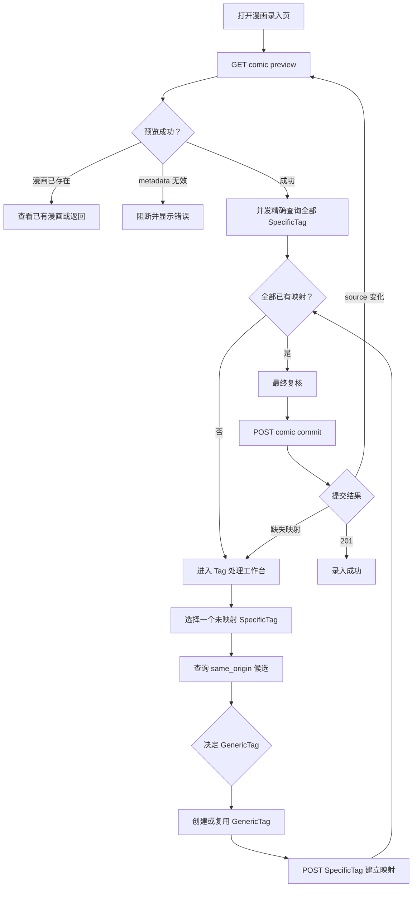

# 漫画录入流程

## 总体状态机



## 1. 进入页面

当前前端页面路由（沿用已有页面入口，不新增后端页面路由）：

```text
/exploror#/entry/{comic_id}
```

只有当前队首可进入该路由；旧链接指向其他漫画时返回队列。`#/entry` 自动选择队首。

页面加载后并行执行：

1. `GET /api/tags/groups`
2. `GET /api/comics/{comic_id}/preview`
3. `GET /api/comics/{comic_id}`：只查询当前漫画是否已入库，返回持久化 Comic；
   仅 404 `COMIC_NOT_FOUND` 表示未入库。无需读取整个 CM 列表。

TagGroup 可以在浏览器会话内缓存；preview 不缓存。
preview 响应体直接是 Comic，不依赖 ETag 或其他版本字段。

加载期间显示漫画级骨架屏，不先渲染空表单，避免用户误以为漫画没有标签。

## 2. 获取精确映射状态

从 preview 返回的 Comic.comic_tags 取得 SpecificTag 后，对每个标签调用：

```http
POST /api/tags/specific/query
{"match": "exact", "specific_tag": {...}}
```

请求应采用有限并发，例如同时 6 个，避免拥有大量标签的漫画瞬间制造过多
SQLite 查询。

每个标签进入以下状态之一：

- `resolved`：精确查询返回一个 SpecificTag ID。
- `unresolved`：没有精确记录。
- `error`：网络错误或服务端验证错误。

数据库唯一约束保证精确查询最多得到一条。如果服务端返回多条，应视为数据损坏，
不得由前端自行选择。
前端需要显示对应 GenericTag 时，再调用该 ID 的 `/generic` 关系接口。

## 3. 处理未映射标签

用户选中一个 `unresolved` 标签后，前端执行：

```http
POST /api/tags/specific/query
{"match": "same_origin", "site": "...", "origin_name": "..."}
```

查询返回 SpecificTag ID 数组。前端按需读取每个 ID 的详情和 `/generic` 关系，
按 GenericTag 的 `(tag_group, name)` 合并候选；需要写入映射时再精确查询其 ID。

### 3.1 有一个 GenericTag 候选

将其显示为“推荐映射”，默认选中但不自动写入。用户点击“采用并处理下一个”后，
才调用 `POST /api/tags/specific`。

这保留 CLI 单候选自动选择的效率，同时让 Web 用户在最终写入前看见决定。

### 3.2 有多个 GenericTag 候选

显示候选目标列表。每个候选下展示促成该候选的 SpecificTag 证据：

- 原始 group
- tag sex
- URL
- site

用户选择的是 GenericTag，不是某条证据 SpecificTag。

### 3.3 没有候选

显示两个互斥操作：

1. 搜索并复用已有 GenericTag。
2. 创建新的 GenericTag。

搜索必须限制在当前选择的 TagGroup 内。

新标签名称默认填入 `origin_name`，但允许编辑。

### 3.4 选择 TagGroup

使用原始 SpecificTag 的信息辅助用户选择，不依赖 preview 附加的推断字段。
未确定分类时必须人工选择，不得默认选择 `tag`。

### 3.5 Group 特殊流程

当选择或推断结果为 `group`：

1. GenericTag 名称默认且优先采用 `origin_name`。
2. 先精确查询 `tag_group=group + name=origin_name`。
3. 已存在则推荐复用。
4. 不存在则推荐创建。

该规则只是界面快捷行为，最终仍然通过通用 GenericTag 和 SpecificTag API 完成。

### 3.6 male/female 变体

当相同 `site + origin_name` 的 male/female 变体指向同一个 GenericTag 时，页面
只显示一个候选目标，同时展开显示两条来源证据。

可以提供：

> 将相同 origin_name 的当前待处理变体映射到同一 GenericTag

该操作逐条创建 SpecificTag 映射，不合并 SpecificTag，也不删除 metadata。

## 4. 建立映射

复用已有 GenericTag：

```http
POST /api/tags/specific
{
  "specific_tag": {...},
  "generic_tag_id": 17
}
```

创建新 GenericTag：

1. `POST /api/tags/generic`
2. 以返回 GenericTag 的 tag_group 和 name 调用 exact 查询取得 ID。
3. `POST /api/tags/specific`

若创建 GenericTag 时收到 `GENERIC_TAG_EXISTS`，以提交的组和名称精确查询后继续第二步，
不要求用户重新操作。

映射成功后：

- 将该标签状态改为 `resolved`。
- 保留返回的原始 SpecificTag；ID 通过 exact 查询取得，GenericTag 通过关系接口读取。
- 自动选中下一个待处理标签。
- 更新页面总进度。

## 5. 最终复核

只有满足以下条件时才启用“录入漫画”按钮：

- preview 加载成功。
- 所有 SpecificTag 精确映射完成。
- 没有正在进行的 Tag 写请求。
- 没有处于 `error` 状态的标签。

复核区显示：

- 漫画 ID、标题和作者。
- 来源站点和来源 ID。
- SpecificTag 总数。
- 按 GenericTag group 汇总的最终标签。
- 本次会话新建的 GenericTag 和 SpecificTag 数量。

这些信息由前端组合已读取的资源。来源信息另行读取 DMB，统计由页面状态计算。

## 6. Comic commit

从队首进入手动工作台时，如果 CM 中已有对应记录，复核页显示“确认更新漫画”及替换范围，
确认后使用现有 `allow_override=true` 参数。未入库漫画仍使用默认的新增行为。

```http
POST /api/comics/{comic_id}/commit
```

请求无需 body。前端不发送 Comic 内容或映射列表。服务端从 DMB 重新读取最新数据并验证
所有标签映射；预览之后的来源变化直接以这次读取为准。

响应处理：

- `201`：显示成功页。
- `COMIC_ALREADY_EXISTS`：显示已录入状态、返回入口及来源数据，不自动覆盖。
- `UNMAPPED_SPECIFIC_TAGS`：用响应中的缺失列表刷新状态，回到工作台。
- 其他错误：保留当前页面状态，显示可重试错误。

### 6.1 按队列自动录入

在待处理队列点击“自动录入”开始，按整个队列的 DMB 更新时间从早到晚处理。
全部精确映射已有时提交；仅 group 未映射时，按来源原名创建或复用通用标签、建立映射后提交。
存在其他未映射类型时整部停止，不先写入部分 group；失败、冲突也停止，后续条目保持等待。
未入库使用默认 commit，已有但需更新的条目使用 `allow_override=true`。

每次提交后，用返回标题进行 CM 精确查询并按 ID 找到持久化记录，同时重新读取 DMB。
只有 CM 时间严格更晚才移出队列并处理下一部；停止操作会等待当前漫画完成。

## 7. 离开页面

来源标签写操作即时保存，已建立的映射不会丢失。待处理队列按 DMB 地址保存来源摘要，
重新打开时默认 anchor 扫描并刷新 CM。手动全量扫描会把新增结果合并进去。
手动工作台返回队列时保留筛选；成功页提供“处理下一部”。筛选不能改变录入顺序。
成功页展示本次 commit 返回的 Comic；已存在状态不会把来源预览冒充为本地记录。

如果仍有尚未写入的选择或正在进行的请求，关闭或跳转页面前使用
`beforeunload` 提示。仅仅存在未映射标签时不弹提示，因为这些状态尚未产生修改。
